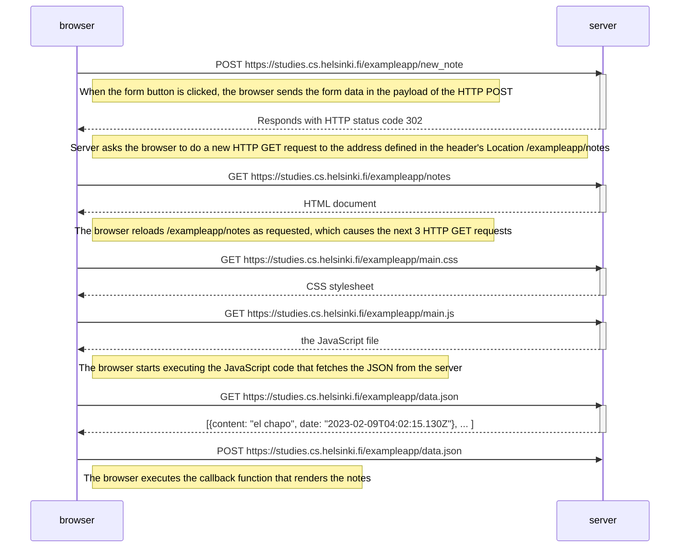
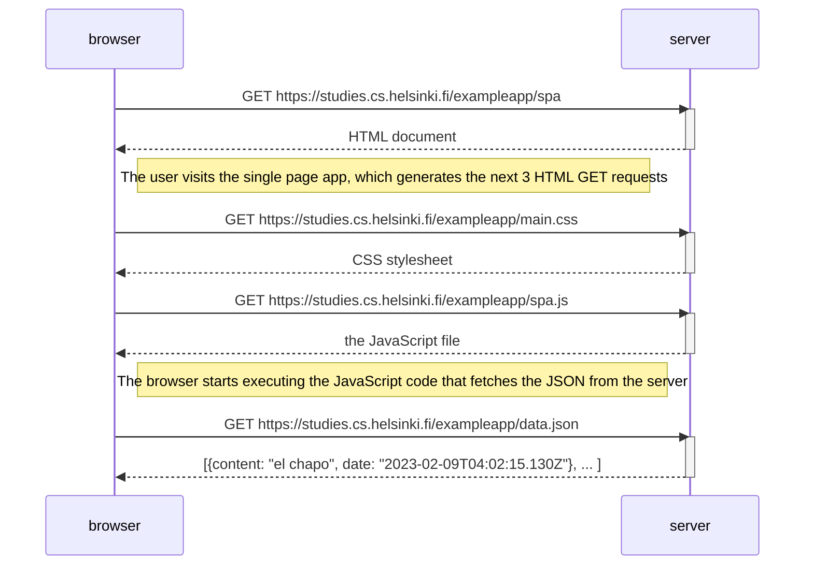
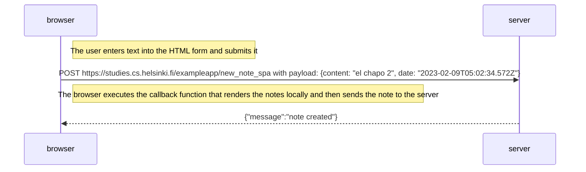

# [Exercises 0.1-0.6](https://fullstackopen.com/en/part0/fundamentals_of_web_apps#exercises-0-1-0-6)

## 0.1: HTML
:heavy_check_mark:

## 0.2: CSS
:heavy_check_mark:

## 0.3: HTML forms
:heavy_check_mark:

## 0.4: New note diagram

## 0.5: Single page app diagram

## 0.6: New note in Single page app diagram

